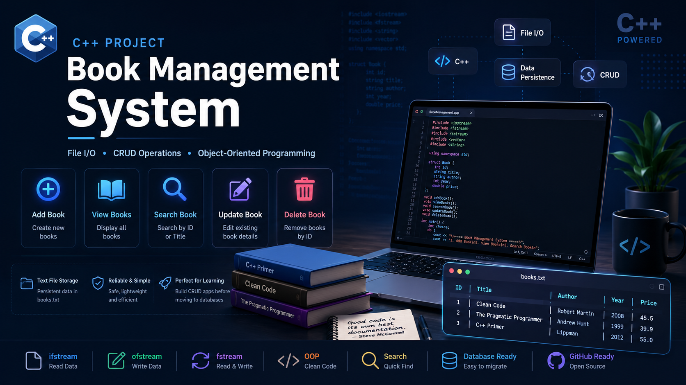

# 📚 Book Management System (C++)

A simple yet professional **Book Management System** built with **C++** that demonstrates **File Handling**, **Object-Oriented Programming**, and complete **CRUD operations** using text files.

---
<p align="center">
  
</p>

## ✨ Features

* ➕ Add new books
* 📖 View all books
* 🔍 Search by ID or Title
* ✏️ Update existing books
* 🗑 Delete books
* 💾 Persistent storage using `books.txt`

---

## 🛠 Tech Stack

* C++
* Object-Oriented Programming (OOP)
* File I/O (`fstream`)
* Text Files
* Standard Template Library (STL)

---

## 📂 Project Structure

```text
BookManagement/
│
├── main.cpp
├── Book.h
├── Book.cpp
├── FileManager.h
├── FileManager.cpp
└── books.txt
```

---

## 📄 Sample Data

```text
1|Clean Code|Robert Martin|2008|45.5
2|The Pragmatic Programmer|Andrew Hunt|1999|39.9
3|C++ Primer|Lippman|2012|55.0
```

---

## 📌 Main Menu

```text
==============================
      Book Management System
==============================

1. Add Book
2. View Books
3. Search Book
4. Update Book
5. Delete Book
6. Exit
```

---

## 🚀 Concepts Covered

* File Handling
* `ifstream`
* `ofstream`
* `fstream`
* `getline()`
* `stringstream`
* `ios::app`
* `ios::in`
* `ios::out`
* `remove()`
* `rename()`
* Parsing text files
* CRUD Operations

---

## 📸 Preview

> *(Add screenshots here after finishing the project.)*

```
assets/
├── menu.png
├── add-book.png
├── search-book.png
├── update-book.png
└── delete-book.png
```

---

## 🎯 Learning Objectives

This project helps you learn:

* Working with text files in C++
* Building real CRUD applications
* Organizing C++ projects
* Data persistence
* Preparing for SQLite and PostgreSQL databases

---

## 👨‍💻 Author

**Marouane Ouhfid**

GitHub: **Ouhfi**

